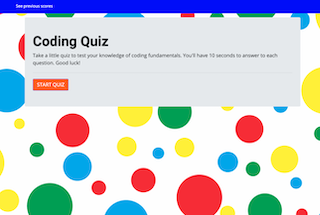

# hw4CodeQuiz

A timed quiz on coding knowledge allowing user to record/track their quiz score/improvement.

# QUIZ CRITERIA

User is presented with a button to start quiz
WHEN user presses button a quiz page appears

- There is a question
- 4 multiple choice answer
- and a 10 second countdown begins.
  WHEN user makes a choice
- answer is checked and a score is tallied (not seen by user)
- clock resets to 10 seconds
- and new question with multiple choice appears.
  IF timer reaches "0" and user does not make a choice
- new question will appear
- timer resets
  WHEN questions are finished
- a "You've completed the quiz" page appears
- user's quiz score of correct answers is revealed
- user is given option to enter and submit name in order to record their score
- name is stored to local storage
- there is also a button to restart the quiz
  IF the user submits their initials
- a scoreboard page appears with all previous scores listed
- new score appears as well as scores retrieved from local storage
- user has two button options: retake quiz or delete all scores

# KNOWN ISSUES

There is trouble with local storage. It was only storing one name and socre.
After working with a TA, it was storing info but rendering "object" on the window page.
After trying to continue to complete the code, something went wrong again - app.js has notes on what I still need to fix.

